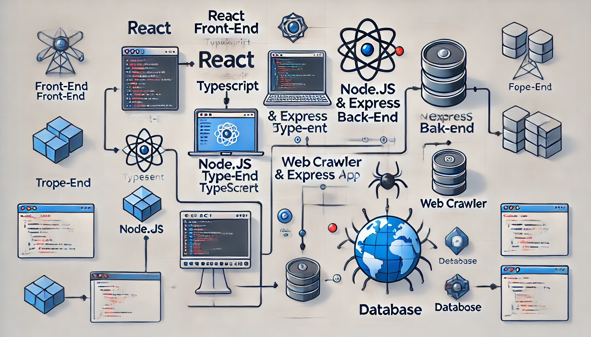

# TypeScript Web Crawler

A simple web crawler built with TypeScript, leveraging `superagent` for HTTP requests and `cheerio` for HTML parsing. This application fetches course information from a demo webpage and parses it into structured JSON data.

## Application Architecture

Below is a diagram representing the architecture of the web crawler app. It includes:
- A **React** front-end built with **TypeScript**.
- A **Node.js** and **Express** back-end to handle API requests.
- A **Web Crawler** component to fetch data from the internet.
- A **Database** to store the crawled data.



## Features

- Fetches HTML content from a specified URL.
- Parses the HTML to extract course information (title and count).
- Outputs the structured data in JSON format.
- Demonstrates TypeScript interfaces and classes for clean and maintainable code.

## Installation

1. **Clone the Repository**:

   ```bash
   git clone <repository-url>
   cd <repository-folder>

   ```

2. **Install Dependencies**:
   ```bash
   npm install
   ```

## Usage

1. **Run the Application**:

   ```bash
   npm run dev

   ```

2. **Expected Output**:
   ```bash
   The application will log JSON-formatted course data extracted from the target URL to the console.
   Below is a sample JSON output generated by the application:
   ```

    ```json
    {
    "time": 1672531200000,
    "data": [
        {
        "title": "TypeScript Basics",
        "count": 100
        },
        {
        "title": "Advanced TypeScript",
        "count": 50
        }
    ]
    }
    ```
    Json Fields: </br>
    time: A timestamp indicating when the data was fetched.</br>
    data: An array of course objects.</br>
    title: The name of the course.</br>
    count: The number of participants or lessons for the course.</br>

## Notes
The application targets a demo URL: http://www.dell-lee.com/typescript/demo.html. </br>
Ensure the target URL is accessible during execution. </br>
Modify the _url or _secret if needed for your use case. </br>

## Future Improvement
Save the extracted data to a file or database. </br>
Add unit tests for critical components. </br>
Enhance error handling for better resilience. </br>